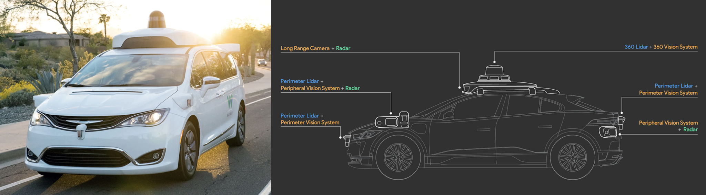
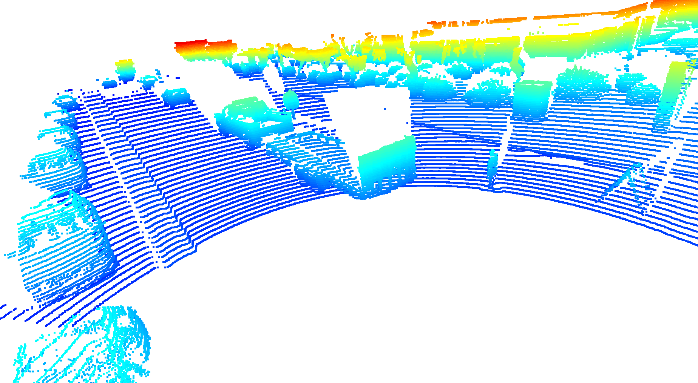
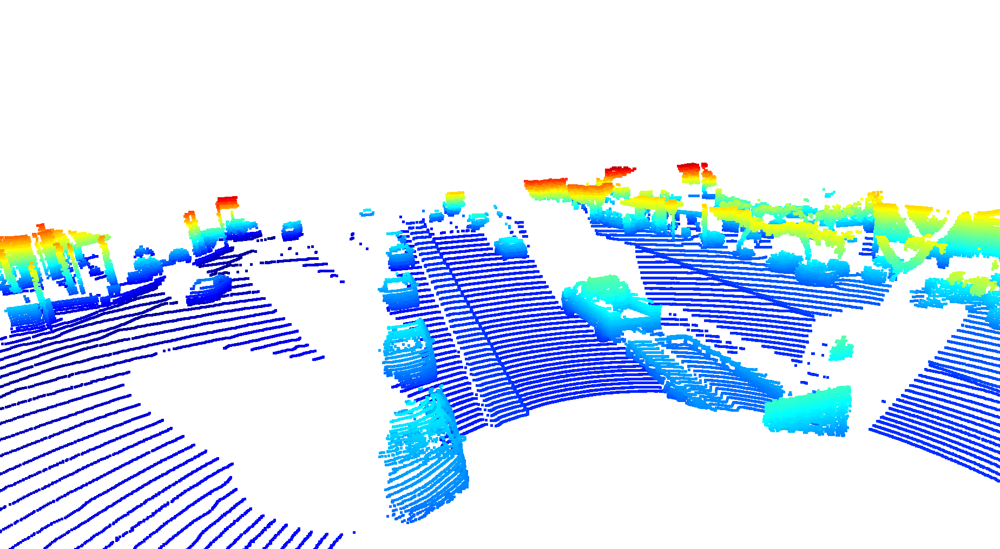
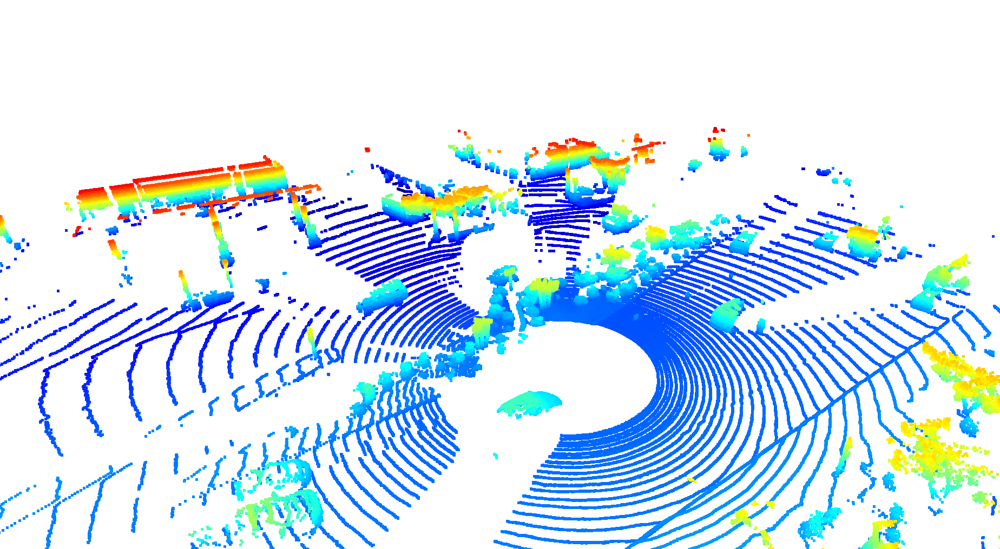
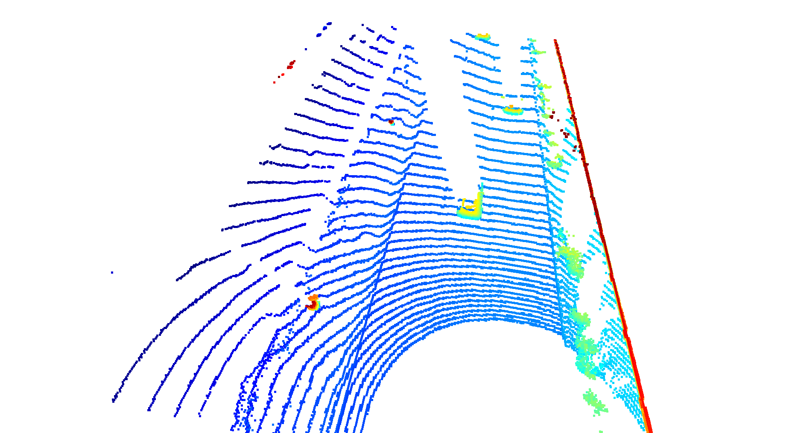
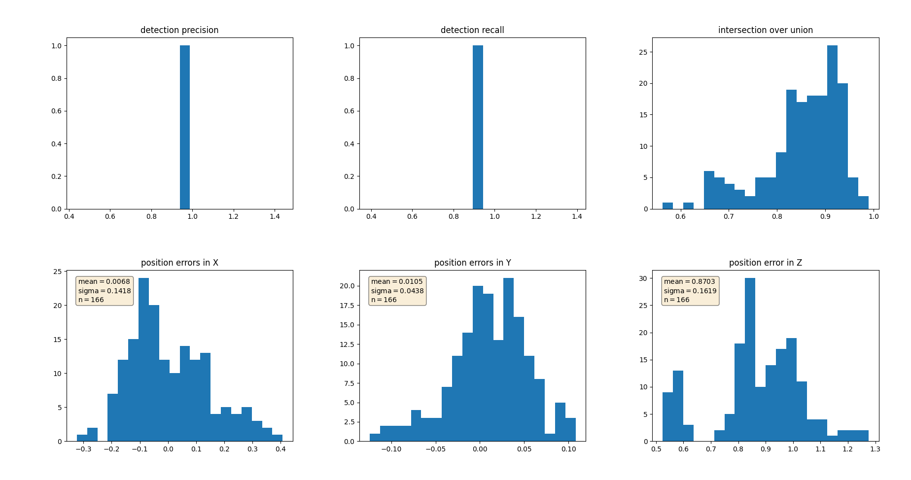

# Autonomous Perception: Tracking 3D-Objects Over Time


Point-cloud and camera image sensor fusion tracking of vehicles utilization the Waymo Open Dataset, Darknet, and FPN ResNet.

## Installation Instructions for Running Locally

### Python
The project has been written using Python 3.8. Please make sure that your local installation is equal or above this version. 

### Package Requirements
All dependencies required for the project have been listed in the file `requirements.txt`. You may either install them one-by-one using pip or you can use the following command to install them all at once: 
`pip3 install -r requirements.txt` 

### Waymo Open Dataset Files
This project makes use of three different sequences to illustrate the concepts of object detection and tracking. These are: 
- Sequence 1 : `training_segment-1005081002024129653_5313_150_5333_150_with_camera_labels.tfrecord`
- Sequence 2 : `training_segment-10072231702153043603_5725_000_5745_000_with_camera_labels.tfrecord`
- Sequence 3 : `training_segment-10963653239323173269_1924_000_1944_000_with_camera_labels.tfrecord`

To download these files, you will have to register with Waymo Open Dataset first (may take up to 48 hours to activate access after registration): [Open Dataset – Waymo](https://waymo.com/open/terms)

Once you have access, download the individual sequences [here](https://console.cloud.google.com/storage/browser/waymo_open_dataset_v_1_2_0_individual_files) from the `training/` folder. Save the `tfrecord`-files into the `dataset` folder of this project.


### Pre-Trained Models
The pre-trained models for the 3D object detection can be downloaded [here](https://drive.google.com/file/d/1Pqx7sShlqKSGmvshTYbNDcUEYyZwfn3A/view?usp=sharing) (darknet) and [here](https://drive.google.com/file/d/1RcEfUIF1pzDZco8PJkZ10OL-wLL2usEj/view?usp=sharing) (fpn_resnet). Once downloaded, please copy the model files into the paths `/tools/objdet_models/darknet/pretrained` and `/tools/objdet_models/fpn_resnet/pretrained` respectively.

### Using Pre-Computed Results

In the main file `loop_over_dataset.py`, you can choose which steps of the algorithm should be executed. If you want to call a specific function, you simply need to add the corresponding string literal to one of the following lists: 

- `exec_detection` : controls which steps of model-based 3D object detection are performed
  - `pcl_from_rangeimage` transforms the Waymo Open Data range image into a 3D point-cloud
  - `load_image` returns the image of the front camera
  - `bev_from_pcl` transforms the point-cloud into a fixed-size birds-eye view perspective
  - `detect_objects` executes the actual detection and returns a set of objects (only vehicles) 
  - `validate_object_labels` decides which ground-truth labels should be considered (e.g. based on difficulty or visibility)
  - `measure_detection_performance` contains methods to evaluate detection performance for a single frame

In case you do not include a specific step into the list, pre-computed binary files will be loaded instead. This enables you to run the algorithm and look at the results even without having implemented anything yet. The pre-computed results for the mid-term project need to be loaded using [this](https://drive.google.com/drive/folders/1-s46dKSrtx8rrNwnObGbly2nO3i4D7r7?usp=sharing) link. Unzip the file within and put its content into the folder `results`.

- `exec_tracking` : controls the execution of the object tracking algorithm

- `exec_visualization` : controls the visualization of results
  - `show_range_image` displays two LiDAR range image channels (range and intensity)
  - `show_labels_in_image` projects ground-truth boxes into the front camera image
  - `show_objects_and_labels_in_bev` projects detected objects and label boxes into the birds-eye view
  - `show_objects_in_bev_labels_in_camera` displays a stacked view with labels inside the camera image on top and the birds-eye view with detected objects on the bottom
  - `show_tracks` displays the tracking results
  - `show_detection_performance` displays the performance evaluation based on all detected 
  - `make_tracking_movie` renders an output movie of the object tracking results

The final project uses pre-computed lidar detections in order for all students to have the same input data. If you use the workspace, the data is prepared there already. Otherwise, [download the pre-computed lidar detections](https://drive.google.com/drive/folders/1IkqFGYTF6Fh_d8J3UjQOSNJ2V42UDZpO?usp=sharing) (~1 GB), unzip them and put them in the folder `results`.

## Engineering Overview

Code languages and packages most used in this work:
* Python
* TensorFlow
* OpenCV
* Point Cloud Library (PCL)
* Open3D
* NumPy
* Matplotlib

Camera-lidar fusion detection takes four steps:
  1. Engineering the Lidar Point-Cloud from range images.
  2. Transform the point cloud to a Bird's Eye View using PCL.
  3. Using both YOLO3 Darknet and Resnet to predict 3D dectections on the combined camera and lidar images.
  4. Evaluating the dections base Precision and Recall.  

#### Key Terms Preview

* Frustum: portion of cone or pyramid that lies between parallel planes
* Voxel: 3D pixel - Volume Element represents unit of 3d space in a grid
* MLP: Multi-layer perceptron
* CNN: Convolutional Neural Network
* YOLO: "You Only Look Once"; object detection via deep learning
* BEV: Birds-eye view
* TP: True Positive - Predicted correct positive label
* TN: True Negative - Predicted correct negative label
* FP: False Positive - dectected object class incorrectly
* FN: False Negative - didn't detect object class when there should be a dectection
* IoU: Intersection over Union
* mAP: Mean Average Precision


## Section 1 : Compute Lidar Point-Cloud from Range Image

[Paper on Dataset](https://arxiv.org/pdf/1912.04838.pdf)



Waymo uses Lidar, cameras, Radar for autonomous navigation.  They even microphones to help detect ambulances and police cars.

Roof-mounted "Top" lidar rotates 360 degrees on top of roof with a vertical field of vision -17.6 degrees to +2.4 degrees with a 75m limit in the dataset. Also space between lidar beams widens with distance.  Limitations of 360 lidar include the space between beams (aka resolution) widening with distance from the origin.  Also the car chasis will create blind spots, creating the need for Perimeter LiDAR sensors:


Perimeter LiDAR has vertical field of vision from -90 degrees to + 30 degrees at up to 20 meters.  Actual sensor range is higher, but the dataset limits at 20m.  Perimeter lidars are on front, back and front corners of vehicle.

### Visualize range image channels (ID_S1_EX1)

Access LiDAR Data:

    -- Frame
      |-- lasers ⇒ one branch for each entry in LaserName
          |-- name (LaserName)
          |-- ri_return1 (RangeImage class)
              |-- range_image_compressed
              |-- camera_projection_compressed
              |-- range_image_pose_compressed
              |-- range_image
          |-- ri_return2 (same as ri_return1)

```
lidar_name = dataset_pb2.LaserName.TOP
lidar = [obj for obj in frame.lasers if obj.name == lidar_name][0]
```

Lidar measurements are stored as a Range Image rather than a point cloud.  Object dectection ground-truth labels (manually labeled) in `Frame.laser_labels`.

    -- Frame
      |-- Context
        |-- name
        |-- camera_calibrations ⇒ one branch for each entry in CameraName
        |-- laser_calibrations ⇒ ⇒ one branch for each entry in LaserName
        |-- Stats
        |-- laser_object_counts
        |-- camera_object_counts
        |-- time_of_day
        |-- location
        |-- weather
      |-- timestamp_micros
      |-- laser_labels ⇒ one branch for each entry in LaserName
      |-- camera_labels ⇒ one branch for each entry in CameraName

Laser calibrations give you the beam inclinations and extrinsic calibration for each laser LED.

Laser Calibrations:
```
lidar_name = dataset_pb2.LaserName.TOP
calib_lidar = [obj for obj in frame.context.laser_calibrations if obj.name == lidar_name][0]

# Retrieving Vertical Field-of-view
vfov_rad = calib_lidar.beam_inclination_max - calib_lidar.beam_inclination_min
print(vfov_rad*180/np.pi)
--> 20.360222720319797
```

Accessing calibrations:
```
calib_lidar.extrinsic.transform
```

There are 64 LEDs in Waymo's top LiDAR sensor.  Extrinsic Calibration Matrix top lidar +1.43m from origin of vehicle coordinate system with height fo +2.184.


Lidar data is stored as a range image in the Waymo Open Dataset. Using OpenCV and NumPy, we filtered the "range" and "intensity" channels from the image, and converted the float data to 8-bit unsigned integers.  Below is a visualization of two video frames, where the top half is the range channel, and the bottom half is the intensity for each visualization: 


### Visualize lidar point-cloud (ID_S1_EX2)

We leveraged the Open3D library to make a 3D interactive visualization of the lidar point-cloud.


  Find and display 6 examples of vehicles with varying degrees of visibility in the point-cloud
  Identify vehicle features that appear as a stable feature on most vehicles (e.g. rear-bumper, tail-lights) and describe them briefly. Also, use the range image viewer from the last example to underpin your findings using the lidar intensity channel.



[comment]:


[comment]:

[comment]:

[comment]:


## Section 2 : Create Birds-Eye View from Lidar PCL

### Convert sensor coordinates to Bird's-Eye View map coordinates (ID_S2_EX1)

The birds-eye view (BEV) of a LiDAR point-cloud is based on the transformation of the x and y coordinates of the points.

BEV map properties:
* Height

  ![H_{i,j} = max(P_{i,j} \cdot [0,0,1]T)](https://render.githubusercontent.com/render/math?math=%5Ctextstyle+H_%7Bi%2Cj%7D+%3D+max%28P_%7Bi%2Cj%7D+%5Ccdot+%5B0%2C0%2C1%5DT%29)

* Intensity 
  

* Density 
  

 is the set of points that falls into each cell, with  as the respective cell coordinates.  refers to the number of points in a cell.




### Compute intensity layer of the BEV map (ID_S2_EX2)

In file loop_over_dataset.py, set the attributes for code execution in the following way:

    data_filename = 'training_segment-1005081002024129653_5313_150_5333_150_with_camera_labels.tfrecord
    show_only_frames = [0, 1]
    exec_data = ['pcl_from_rangeimage']
    exec_detection = ['bev_from_pcl']
    exec_tracking = []
    exec_visualization = []


The goal of this task is to fill the "intensity" channel of the BEV map with data from the point-cloud. In order to do so, you will need to identify all points with the same (x,y)-coordinates within the BEV map and then assign the intensity value of the top-most lidar point to the respective BEV pixel. Please name the resulting list of points lidar_pcl_top as it will be re-used in later tasks. Also, you will need to normalize the resulting intensity image using percentiles, in order to make sure that the influence of outlier values (very bright and very dark regions) is sufficiently mitigated and objects of interest (e.g. vehicles) are clearly separated from the background. 


### Compute height layer of the BEV map (ID_S2_EX3)

In file loop_over_dataset.py, set the attributes for code execution in the following way:

    data_filename = 'training_segment-1005081002024129653_5313_150_5333_150_with_camera_labels.tfrecord
    show_only_frames = [0, 1]
    exec_data = ['pcl_from_rangeimage']
    exec_detection = ['bev_from_pcl']
    exec_tracking = []
    exec_visualization = []


The goal of this task is to fill the "height" channel of the BEV map with data from the point-cloud. In order to do so, please make use of the sorted and pruned point-cloud lidar_pcl_top from the previous task and normalize the height in each BEV map pixel by the difference between max. and min. height which is defined in the configs structure.


## Section 3 : Model-based Object Detection in BEV Image

### Add a second model from a GitHub repo (ID_S3_EX1)

In file loop_over_dataset.py, set the attributes for code execution in the following way:

    data_filename = 'training_segment-1005081002024129653_5313_150_5333_150_with_camera_labels.tfrecord
    show_only_frames = [50, 51]
    exec_data = ['pcl_from_rangeimage', 'load_image']
    exec_detection = ['bev_from_pcl', 'detect_objects']
    exec_tracking = []
    exec_visualization = ['show_objects_in_bev_labels_in_camera']
    configs_det = det.load_configs(model_name="fpn_resnet")

We used YOLO3 and Resnet deep-learning models to doe 3D Object Detection.  Complex-YOLO: Real-time 3D Object Detection on Point Clouds and Super Fast and Accurate 3D Object Detection based on 3D LiDAR Point Clouds.

### Extract 3D bounding boxes from model response (ID_S3_EX2)

In file loop_over_dataset.py, set the attributes for code execution in the following way:

    data_filename = 'training_segment-1005081002024129653_5313_150_5333_150_with_camera_labels.tfrecord
    show_only_frames = [50, 51]
    exec_data = ['pcl_from_rangeimage', 'load_image']
    exec_detection = ['bev_from_pcl', 'detect_objects']
    exec_tracking = []
    exec_visualization = ['show_objects_in_bev_labels_in_camera']
    configs_det = det.load_configs(model_name="fpn_resnet")

As the model input is a three-channel BEV map, the detected objects will be returned with coordinates and properties in the BEV coordinate space. Thus, before the detections can move along in the processing pipeline, they need to be converted into metric coordinates in vehicle space. This task is about performing this conversion such that all detections have the format [1, x, y, z, h, w, l, yaw], where 1 denotes the class id for the object type vehicle. 

The models take a three-channel BEV map as an input, and predict the class about coordinates of objects (vehicles).  We then transformed these BEV coordinates back to the vehicles coordinate-space to draw the bounding boxes in both images.


Below is a gif the of detections in action:


## Section 4 : Performance Evaluation for Object Detection

### Compute intersection-over-union between labels and detections (ID_S4_EX1)

In file loop_over_dataset.py, set the attributes for code execution in the following way:

    data_filename = 'training_segment-1005081002024129653_5313_150_5333_150_with_camera_labels.tfrecord
    show_only_frames = [50, 51]
    exec_data = ['pcl_from_rangeimage']
    exec_detection = ['bev_from_pcl', 'detect_objects', 'validate_object_labels', 'measure_detection_performance']
    exec_tracking = []
    exec_visualization = ['show_detection_performance']
    configs_det = det.load_configs(model_name="darknet")


The goal of this task is to find pairings between ground-truth labels and detections, so that we can determine wether an object has been (a) missed (false negative), (b) successfully detected (true positive) or (c) has been falsely reported (false positive). Based on the labels within the Waymo Open Dataset, your task is to compute the geometrical overlap between the bounding boxes of labels and detected objects and determine the percentage of this overlap in relation to the area of the bounding boxes. A default method in the literature to arrive at this value is called intersection over union, which is what you will need to implement in this task.

A detailed description of all required steps can be found in the code.
What your result should look like

After looping over all pairings of labels and detections, the data structures ious and center_devs should show the following content for frame 50 of the sequence defined in section "task preparations":


    
### Compute false-negatives and false-positives (ID_S4_EX2)

Based on the pairings between ground-truth labels and detected objects, the goal of this task is to determine the number of false positives and false negatives for the current frame. After all frames have been processed, an overall performance measure will be computed based on the results produced in this task.

A detailed description of all required steps can be found in the code.
What your result should look like

After looping over all pairings of labels and detections, the data structure det_performance should show the following content for frame 50 of the sequence.

#### Key Terms:
* *TP*: True Positive - Predicts vehicle or other object is there correctly
* *TN*: True Negative - Correctly predicts vehicle or object is not present
* *FP*: False Positive - Dectects object class incorrectly
* *FN*: False Negative - Didn't detect object class when there should be a dectection

### Compute precision and recall (ID_S4_EX3)

    data_filename = 'training_segment-1005081002024129653_5313_150_5333_150_with_camera_labels.tfrecord
    show_only_frames = [50, 150]
    exec_data = ['pcl_from_rangeimage']
    exec_detection = ['bev_from_pcl', 'detect_objects', 'validate_object_labels', 'measure_detection_performance']
    exec_tracking = []
    exec_visualization = ['show_detection_performance']
    configs_det = det.load_configs(model_name="darknet")

After all the Lidar and Camera data has been transformed, and the detections have been predicted, we calculate the Precision and Recall metrics for the bounding box predictions:

#### Key Terms

* *IoU*: Intersection over Union
* *mAP*: Mean Average Precision

#### Formulas

* *Precision*:

    


* *Recall*: 

    

* *Accuracy*: 
    
    


* *Mean Average Precision*: 
    
    

### Precision and Recall Visualizations

Results from two frames:


Results from sixty frames:


### 2. Do you see any benefits in camera-lidar fusion compared to lidar-only tracking (in theory and in your concrete results)? 

Up to the point in which more sensors compromise necessary latency of vehicle actions, more sensors and sensor-fusion improves over single-sensor results.  Noise, sensor-failure, and individual sensor weaknesses can be more easily compensated for with additional sensors.

Benefits of camera-lidar fusion over exclusively leveraging lidar data are many.  Point there are certain kinds of reflective surfaces lidar can struggle with - adding camera sensory information can help resolve issues where there is noise in the lidar.  More sensor data is generally helpful up to the threshold where it effects production performance.


### 3. Which challenges will a sensor fusion system face in real-life scenarios? Did you see any of these challenges in the project?

In real-life, dirty data, latency of preprocessing and predicting with live data, camera's being effected or obscured by weather, lidar dealing with surfaces that provide too much noise or non-optimal measurements.  Dealing with the fact that camera images are a 2D project of a 3d world.  The cost of getting the "best" or "fastest" sensors vs. what consumers will purchase.

Object dectection is based on deep learning models that "learn" based on a large number of examples in a dataset.  It is probably impossible to represent every scenario that will every happen while driving - so the battle is getting enough examples of common occurances and putting in enough safety measures so the car to percieve and act safely.


### 4. Can you think of ways to improve your tracking results in the future?

Yes, having more data.  Going through and checking the annotations to make sure they are correct. 


## More Details and Notes

## Sensors

Another interesting real-world sensor issue is that acceleration, deceleration, potholes, and other factors can change the pitch, or angle of the car relative to the road. So the car or robot perception systems need to be able to adapt to these changes in sensor orientation. Lidar can also be sensitive to vibrations coming from motors, actuators, or other sources on the vehicle or robot.


### TF Records

Each Waymo Dataset TF Record file contains 200 frames of data.

Top Level:

    |-- LaserName
    |-- CameraName
    |-- RollingShutterReadOutDirection
    |-- Frame
    |-- Label

Frame Level:

    -- Frame
      |-- images
      |-- Context
          |-- name
          |-- camera_calibrations
          |-- laser_calibrations
          |-- Stats
          |-- laser_object_counts
          |-- camera_object_counts
          |-- time_of_day
          |-- location
          |-- weather
      |-- timestamp_micros
      |-- pose
      |-- lasers
      |-- laser_labels
      |-- projected_lidar_labels (same as camera_labels)
      |-- camera_labels
      |-- no_label_zones


Camera Images:


    -- Frame
      |-- images ⇒ one branch for each entry in CameraName
          |-- name (CameraName)
          |-- image
          |-- pose
          |-- velocity (v_x, v_y, v_z, w_x, w_y, w_z)
          |-- pose_timestamp
          |-- shutter
          |-- camera_trigger_time
          |-- camera_readout_done_time

Specific Camera:
```
camera_name = dataset_pb2.CameraName.FRONT
image = [obj for obj in frame.images if obj.name == camera_name][0]
```

Display Camera Image:
```
from PIL import Image
import io

# convert the image into rgb format
image = np.array(Image.open(io.BytesIO(camera.image)))
image = cv2.cvtColor(image, cv2.COLOR_BGR2RGB)

# resize the image to better fit the screen
dim = (int(image.shape[1] * 0.5), int(image.shape[0] * 0.5))
resized = cv2.resize(image, dim)

# display the image 
cv2.imshow("Front-camera image", resized)
cv2.waitKey(0)
```


## Lidar

Lidar is an active sensor, meaning it produces it's own laser light and measures the reflections off surfaces back to the sensor.  It uses time-of-flight (ToF) calcultions which allow LiDAR sensors to calculate distance from source.

The movitation behind this work is my desire to do advanced AI work with autonomous robots.  Lidar is a crucical component to many advanced robotics perception activities, is starting to come in iphones and ipads, and is continuously getting cheaper.  I both find the technology and its applications fascinating, and believe it will continue to become cheaper and more prevelant over the next decade.

Autonomous vehicles typically have top-mounted 360 degree LiDAR, which often can create very accurate 3D point maps of the environment around the car.  A limitation is that objects can block LiDAR lasers from detecting what's behind cars and other objects.  Where a camera or person can "see" though a car window and know that if a pedestrian is about to walk onto the street from behind a car, LiDAR lasers would refect of of the car windows and never get a reading of the person.  This is a reason why sensor fusion is so vito to autonomous robotics.

There is also non-scanning LiDAR called Flash LiDAR, which points in one direction and "flashes" laser light into the field of view head of it, rather than scanning in a range of 2d or 3d degrees.

360-degree scannning LiDAR typically views in an 80-100 meter range, and Flash LiDAR is usually mounted on the corners of the vehicle to detect areas immediately next to the vehicle in the 3D sensors blind-spot.

LiDAR can detect anywhere from the immediate vicinity to 200 meters.


## External Dependencies
Parts of this project are based on the following repositories: 
- [Simple Waymo Open Dataset Reader](https://github.com/gdlg/simple-waymo-open-dataset-reader)
- [Super Fast and Accurate 3D Object Detection based on 3D LiDAR Point Clouds](https://github.com/maudzung/SFA3D)
- [Complex-YOLO: Real-time 3D Object Detection on Point Clouds](https://github.com/maudzung/Complex-YOLOv4-Pytorch)


## License
[License](LICENSE.md)
