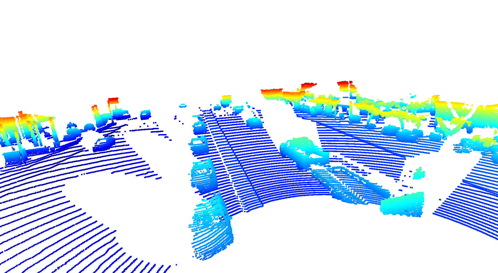
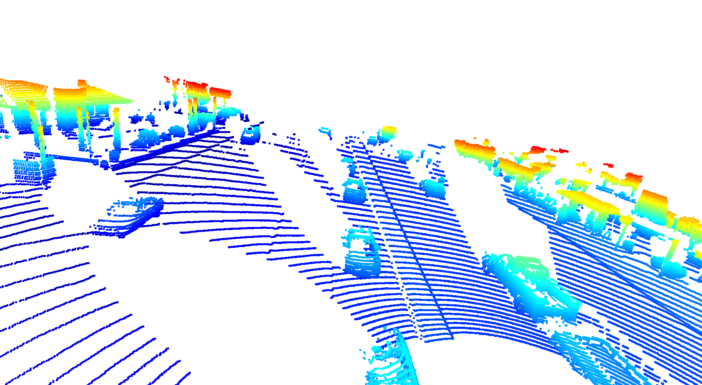
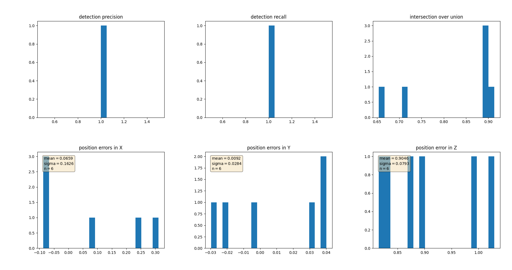

# Autonomous Perception: Tracking 3D-Objects Over Time

** **README IS CURRENTLY A ROUGH DRAFT AND BEING UPDATED DAILY** **

### 1. Write a short recap of the four tracking steps and what you implemented there (filter, track management, association, camera fusion). Which results did you achieve? Which part of the project was most difficult for you to complete, and why?

Camera-lidar fusion detection takes four steps:
  1. Engineering the Lidar Point-Cloud from range images.
  2. Transform the point cloud to a Bird's Eye View using PCL.
  3. Using both YOLO3 Darknet and Resnet to predict 3D dectections on the combined camera and lidar images.
  4. Evaluating the dections base Precision and Recall.  

#### Visualize range image channels (ID_S1_EX1)

Lidar data is stored as a range image in the Waymo Open Dataset. Using OpenCV and NumPy, we filtered the "range" and "intensity" channels from the image, and converted the float data to 8-bit unsigned integers.  Below is a visualization of two video frames, where the top half is the range channel, and the bottom half is the intensity for each visualization: 

#### Visualize lidar point-cloud (ID_S1_EX2)

We leveraged the Open3D library to make a 3D interactive visualization of the lidar point-cloud.

    Find and display 6 examples of vehicles with varying degrees of visibility in the point-cloud
    Identify vehicle features that appear as a stable feature on most vehicles (e.g. rear-bumper, tail-lights) and describe them briefly. Also, use the range image viewer from the last example to underpin your findings using the lidar intensity channel.

#### Convert sensor coordinates to BEV-map coordinates (ID_S2_EX1)

Where to find this task?

This task involves writing code within the function bev_from_pcl located in the file student/objdet_pcl.py.

What this task is about?

The goal of this task is to perform the first step in creating a birds-eye view (BEV) perspective of the lidar point-cloud. Based on the (x,y)-coordinates in sensor space, you must compute the respective coordinates within the BEV coordinate space so that in subsequent tasks, the actual BEV map can be filled with lidar data from the point-cloud.

A detailed description of all required steps can be found in the code.

### 3
Add a second model from a GitHub repo (ID_S3_EX1)
Task preparations

In file loop_over_dataset.py, set the attributes for code execution in the following way:

    data_filename = 'training_segment-1005081002024129653_5313_150_5333_150_with_camera_labels.tfrecord
    show_only_frames = [50, 51]
    exec_data = ['pcl_from_rangeimage', 'load_image']
    exec_detection = ['bev_from_pcl', 'detect_objects']
    exec_tracking = []
    exec_visualization = ['show_objects_in_bev_labels_in_camera']
    configs_det = det.load_configs(model_name="fpn_resnet")

Where to find this task?

This task involves writing code within the functions detect_objects, load_configs_model and create_model located in the file student/objdet_detect.py.
What this task is about?

The model-based detection of objects in lidar point-clouds using deep-learning is a heavily researched area with new approaches appearing in the literature and on GitHub every few weeks. On the website Papers With Code and on GitHub, several repositories with code for object detection can be found, such as Complex-YOLO: Real-time 3D Object Detection on Point Clouds and Super Fast and Accurate 3D Object Detection based on 3D LiDAR Point Clouds.

The goal of this task is to illustrate how a new model can be integrated into an existing framework. The task consists of the following steps:

    Clone the repo Super Fast and Accurate 3D Object Detection based on 3D LiDAR Point Clouds
    Familiarize yourself with the code in SFA3D->test.py with the goal of understanding the steps involved for performing inference with a pre-trained model
    Extract the relevant parameters from SFA3D->test.py->parse_test_configs() and add them to the configs structure in load_configs_model.
    Instantiate the model for fpn_resnet in create_model.
    After model inference has been performed, decode the output and perform post-processing in detect_objects-
    Visualize the results by setting the flag show_objects_in_bev_labels_in_camera

Note that the pre-trained model from SFA3D as well as the model classes and some helper functions have already been integrated into the mid-term project. You can find all related files in the folder tools/objdet_models/resnet.

Also note that in this project, we are only focussing on the detection of vehicles, even though the Waymo Open dataset contains labels for other road users as well.
What your result should look like

Note that the visualization of tracking results will be implemented in the next task. At this point, the content of detections should look like this in the VS Code inspector:
An example of `detections` data, showing the various variables and arrays making it up

An example of detections data
Extract 3D bounding boxes from model response (ID_S3_EX2)
Task preparations

In file loop_over_dataset.py, set the attributes for code execution in the following way:

    data_filename = 'training_segment-1005081002024129653_5313_150_5333_150_with_camera_labels.tfrecord
    show_only_frames = [50, 51]
    exec_data = ['pcl_from_rangeimage', 'load_image']
    exec_detection = ['bev_from_pcl', 'detect_objects']
    exec_tracking = []
    exec_visualization = ['show_objects_in_bev_labels_in_camera']
    configs_det = det.load_configs(model_name="fpn_resnet")

Where to find this task?

This task involves writing code within detect_objects located in the file student/objdet_detect.py.
What this task is about?

As the model input is a three-channel BEV map, the detected objects will be returned with coordinates and properties in the BEV coordinate space. Thus, before the detections can move along in the processing pipeline, they need to be converted into metric coordinates in vehicle space. This task is about performing this conversion such that all detections have the format [1, x, y, z, h, w, l, yaw], where 1 denotes the class id for the object type vehicle. 

### 4

Compute intersection-over-union between labels and detections (ID_S4_EX1)
Task preparations

In file loop_over_dataset.py, set the attributes for code execution in the following way:

    data_filename = 'training_segment-1005081002024129653_5313_150_5333_150_with_camera_labels.tfrecord
    show_only_frames = [50, 51]
    exec_data = ['pcl_from_rangeimage']
    exec_detection = ['bev_from_pcl', 'detect_objects', 'validate_object_labels', 'measure_detection_performance']
    exec_tracking = []
    exec_visualization = ['show_detection_performance']
    configs_det = det.load_configs(model_name="darknet")

Where to find this task?

This task involves writing code within detect_objects located in the file student/objdet_eval.py.
What this task is about?

The goal of this task is to find pairings between ground-truth labels and detections, so that we can determine wether an object has been (a) missed (false negative), (b) successfully detected (true positive) or (c) has been falsely reported (false positive). Based on the labels within the Waymo Open Dataset, your task is to compute the geometrical overlap between the bounding boxes of labels and detected objects and determine the percentage of this overlap in relation to the area of the bounding boxes. A default method in the literature to arrive at this value is called intersection over union, which is what you will need to implement in this task.

A detailed description of all required steps can be found in the code.
What your result should look like

After looping over all pairings of labels and detections, the data structures ious and center_devs should show the following content for frame 50 of the sequence defined in section "task preparations":
Example IOU values - in this case, two values around 0.75

Example IOU values
Example `center_devs` values - in this case, two arrays each with three values somewhere between -1 and 1

Example center_devs values
Tips for the implementation

    Use the function tools.compute_box_corners to extract the four corners of a bounding box, which can be easily used with the Polygon structure of the Shapely toolbox.
    In case of multiple matches, keep the object/label pair with max. IOU

Compute false-negatives and false-positives (ID_S4_EX2)
Task preparations

Please use the settings of the previous task
Where to find this task?

This task involves writing code within detect_objects located in the file student/objdet_eval.py.
What this task is about?

Based on the pairings between ground-truth labels and detected objects, the goal of this task is to determine the number of false positives and false negatives for the current frame. After all frames have been processed, an overall performance measure will be computed based on the results produced in this task.

A detailed description of all required steps can be found in the code.
What your result should look like

After looping over all pairings of labels and detections, the data structure det_performance should show the following content for frame 50 of the sequence defined in section "task preparations":
Example `det_performance` values - made up of arrays of varying values and length

Example det_performance values
Compute precision and recall (ID_S4_EX3)
Task preparations

In file loop_over_dataset.py, set the attributes for code execution in the following way:

    data_filename = 'training_segment-1005081002024129653_5313_150_5333_150_with_camera_labels.tfrecord
    show_only_frames = [50, 150]
    exec_data = ['pcl_from_rangeimage']
    exec_detection = ['bev_from_pcl', 'detect_objects', 'validate_object_labels', 'measure_detection_performance']
    exec_tracking = []
    exec_visualization = ['show_detection_performance']
    configs_det = det.load_configs(model_name="darknet")

Where to find this task?

This task involves writing code within detect_objects located in the file student/objdet_eval.py.
What this task is about?

After processing all the frames of a sequence, the performance of the object detection algorithm shall now be evaluated. To do so in a meaningful way, the two standard measures "precision" and "recall" will be used, which are based on the accumulated number of positives and negatives from all frames.

A detailed description of all required steps can be found in the code.
What your result should look like

For the frame sequence defined in "task preparations", the following performance measures should result: 

### 2. Do you see any benefits in camera-lidar fusion compared to lidar-only tracking (in theory and in your concrete results)? 

Up to the point in which more sensors compromise necessary latency of vehicle actions, more sensors and sensor-fusion improves over single-sensor results.  Noise, sensor-failure, and individual sensor weaknesses can be more easily compensated for with additional sensors.

Benefits of camera-lidar fusion over exclusively leveraging lidar data are many.  Point there are certain kinds of reflective surfaces lidar can struggle with - adding camera sensory information can help resolve issues where there is noise in the lidar.  More sensor data is generally helpful up to the threshold where it effects production performance.

### 3. Which challenges will a sensor fusion system face in real-life scenarios? Did you see any of these challenges in the project?

In real-life, dirty data, latency of preprocessing and predicting with live data, camera's being effected or obscured by weather, lidar dealing with surfaces that provide too much noise or non-optimal measurements.  Dealing with the fact that camera images are a 2D project of a 3d world.  The cost of getting the "best" or "fastest" sensors vs. what consumers will purchase.

Object dectection is based on deep learning models that "learn" based on a large number of examples in a dataset.  It is probably impossible to represent every scenario that will every happen while driving - so the battle is getting enough examples of common occurances and putting in enough safety measures so the car to percieve and act safely.

### 4. Can you think of ways to improve your tracking results in the future?

Yes, having more data.  Going through and checking the annotations to make sure they are correct.

## Key Terms

* Frustum: portion of cone or pyramid that lies between parallel planes
* Voxel: 3D pixel - Volume Element represents unit of 3d space in a grid
* MLP: Multi-layer perceptron
* CNN: Convolutional Neural Network
* YOLO: "You Only Look Once"; object detection via deep learning
* BEV: Birds-eye view
* TP: True Positive - Predicted correct positive label
* TN: True Negative - Predicted correct negative label
* FP: False Positive - dectected object class incorrectly
* FN: False Negative - didn't detect object class when there should be a dectection
* IoU: Intersection over Union
* mAP: Mean Average Precision

## Equations

BEV map properties:
* Height

  ![H_{i,j} = max(P_{i,j} \cdot [0,0,1]T)](https://render.githubusercontent.com/render/math?math=%5Ctextstyle+H_%7Bi%2Cj%7D+%3D+max%28P_%7Bi%2Cj%7D+%5Ccdot+%5B0%2C0%2C1%5DT%29)

* Intensity 
  

* Density 
  

 is the set of points that falls into each cell, with  as the respective cell coordinates.  refers to the number of points in a cell.

Precision and recall:

Precision:

  

Recall:

  

Accuracy:

  

Average Precision:

  

---------

# SDCND : Sensor Fusion and Tracking
This is the project for the second course in the  [Udacity Self-Driving Car Engineer Nanodegree Program](https://www.udacity.com/course/c-plus-plus-nanodegree--nd213) : Sensor Fusion and Tracking. 

In this project, you'll fuse measurements from LiDAR and camera and track vehicles over time. You will be using real-world data from the Waymo Open Dataset, detect objects in 3D point clouds and apply an extended Kalman filter for sensor fusion and tracking.

The project consists of two major parts: 
1. **Object detection**: In this part, a deep-learning approach is used to detect vehicles in LiDAR data based on a birds-eye view perspective of the 3D point-cloud. Also, a series of performance measures is used to evaluate the performance of the detection approach. 
2. **Object tracking** : In this part, an extended Kalman filter is used to track vehicles over time, based on the lidar detections fused with camera detections. Data association and track management are implemented as well.

The following diagram contains an outline of the data flow and of the individual steps that make up the algorithm. 

Also, the project code contains various tasks, which are detailed step-by-step in the code. More information on the algorithm and on the tasks can be found in the Udacity classroom. 

## Project File Structure

📦project 
 ┣ 📂dataset --> contains the Waymo Open Dataset sequences  
 ┃ 
 ┣ 📂misc 
 ┃ ┣ evaluation.py --> plot functions for tracking visualization and RMSE calculation 
 ┃ ┣ helpers.py --> misc. helper functions, e.g. for loading / saving binary files 
 ┃ ┗ objdet_tools.py --> object detection functions without student tasks 
 ┃ ┗ params.py --> parameter file for the tracking part 
 ┃  
 ┣ 📂results --> binary files with pre-computed intermediate results 
 ┃  
 ┣ 📂student  
 ┃ ┣ association.py --> data association logic for assigning measurements to tracks incl. student tasks  
 ┃ ┣ filter.py --> extended Kalman filter implementation incl. student tasks  
 ┃ ┣ measurements.py --> sensor and measurement classes for camera and lidar incl. student tasks  
 ┃ ┣ objdet_detect.py --> model-based object detection incl. student tasks  
 ┃ ┣ objdet_eval.py --> performance assessment for object detection incl. student tasks  
 ┃ ┣ objdet_pcl.py --> point-cloud functions, e.g. for birds-eye view incl. student tasks  
 ┃ ┗ trackmanagement.py --> track and track management classes incl. student tasks   
 ┃  
 ┣ 📂tools --> external tools 
 ┃ ┣ 📂objdet_models --> models for object detection 
 ┃ ┃ ┃ 
 ┃ ┃ ┣ 📂darknet 
 ┃ ┃ ┃ ┣ 📂config 
 ┃ ┃ ┃ ┣ 📂models --> darknet / yolo model class and tools 
 ┃ ┃ ┃ ┣ 📂pretrained --> copy pre-trained model file here 
 ┃ ┃ ┃ ┃ ┗ complex_yolov4_mse_loss.pth 
 ┃ ┃ ┃ ┣ 📂utils --> various helper functions 
 ┃ ┃ ┃ 
 ┃ ┃ ┗ 📂resnet 
 ┃ ┃ ┃ ┣ 📂models --> fpn_resnet model class and tools 
 ┃ ┃ ┃ ┣ 📂pretrained --> copy pre-trained model file here  
 ┃ ┃ ┃ ┃ ┗ fpn_resnet_18_epoch_300.pth  
 ┃ ┃ ┃ ┣ 📂utils --> various helper functions 
 ┃ ┃ ┃ 
 ┃ ┗ 📂waymo_reader --> functions for light-weight loading of Waymo sequences 
 ┃ 
 ┣ basic_loop.py 
 ┣ loop_over_dataset.py 

## Installation Instructions for Running Locally
### Cloning the Project
In order to create a local copy of the project, please click on "Code" and then "Download ZIP". Alternatively, you may of-course use GitHub Desktop or Git Bash for this purpose. 

### Python
The project has been written using Python 3.7. Please make sure that your local installation is equal or above this version. 

### Package Requirements
All dependencies required for the project have been listed in the file `requirements.txt`. You may either install them one-by-one using pip or you can use the following command to install them all at once: 
`pip3 install -r requirements.txt` 

### Waymo Open Dataset Reader
The Waymo Open Dataset Reader is a very convenient toolbox that allows you to access sequences from the Waymo Open Dataset without the need of installing all of the heavy-weight dependencies that come along with the official toolbox. The installation instructions can be found in `tools/waymo_reader/README.md`. 

### Waymo Open Dataset Files
This project makes use of three different sequences to illustrate the concepts of object detection and tracking. These are: 
- Sequence 1 : `training_segment-1005081002024129653_5313_150_5333_150_with_camera_labels.tfrecord`
- Sequence 2 : `training_segment-10072231702153043603_5725_000_5745_000_with_camera_labels.tfrecord`
- Sequence 3 : `training_segment-10963653239323173269_1924_000_1944_000_with_camera_labels.tfrecord`

To download these files, you will have to register with Waymo Open Dataset first: [Open Dataset – Waymo](https://waymo.com/open/terms), if you have not already, making sure to note "Udacity" as your institution.

Once you have done so, please [click here](https://console.cloud.google.com/storage/browser/waymo_open_dataset_v_1_2_0_individual_files) to access the Google Cloud Container that holds all the sequences. Once you have been cleared for access by Waymo (which might take up to 48 hours), you can download the individual sequences. 

The sequences listed above can be found in the folder "training". Please download them and put the `tfrecord`-files into the `dataset` folder of this project.

### Pre-Trained Models
The object detection methods used in this project use pre-trained models which have been provided by the original authors. They can be downloaded [here](https://drive.google.com/file/d/1Pqx7sShlqKSGmvshTYbNDcUEYyZwfn3A/view?usp=sharing) (darknet) and [here](https://drive.google.com/file/d/1RcEfUIF1pzDZco8PJkZ10OL-wLL2usEj/view?usp=sharing) (fpn_resnet). Once downloaded, please copy the model files into the paths `/tools/objdet_models/darknet/pretrained` and `/tools/objdet_models/fpn_resnet/pretrained` respectively.

### Using Pre-Computed Results

In the main file `loop_over_dataset.py`, you can choose which steps of the algorithm should be executed. If you want to call a specific function, you simply need to add the corresponding string literal to one of the following lists: 

- `exec_data` : controls the execution of steps related to sensor data. 
  - `pcl_from_rangeimage` transforms the Waymo Open Data range image into a 3D point-cloud
  - `load_image` returns the image of the front camera

- `exec_detection` : controls which steps of model-based 3D object detection are performed
  - `bev_from_pcl` transforms the point-cloud into a fixed-size birds-eye view perspective
  - `detect_objects` executes the actual detection and returns a set of objects (only vehicles) 
  - `validate_object_labels` decides which ground-truth labels should be considered (e.g. based on difficulty or visibility)
  - `measure_detection_performance` contains methods to evaluate detection performance for a single frame

In case you do not include a specific step into the list, pre-computed binary files will be loaded instead. This enables you to run the algorithm and look at the results even without having implemented anything yet. The pre-computed results for the mid-term project need to be loaded using [this](https://drive.google.com/drive/folders/1-s46dKSrtx8rrNwnObGbly2nO3i4D7r7?usp=sharing) link. Please use the folder `darknet` first. Unzip the file within and put its content into the folder `results`.

- `exec_tracking` : controls the execution of the object tracking algorithm

- `exec_visualization` : controls the visualization of results
  - `show_range_image` displays two LiDAR range image channels (range and intensity)
  - `show_labels_in_image` projects ground-truth boxes into the front camera image
  - `show_objects_and_labels_in_bev` projects detected objects and label boxes into the birds-eye view
  - `show_objects_in_bev_labels_in_camera` displays a stacked view with labels inside the camera image on top and the birds-eye view with detected objects on the bottom
  - `show_tracks` displays the tracking results
  - `show_detection_performance` displays the performance evaluation based on all detected 
  - `make_tracking_movie` renders an output movie of the object tracking results

Even without solving any of the tasks, the project code can be executed. 

The final project uses pre-computed lidar detections in order for all students to have the same input data. If you use the workspace, the data is prepared there already. Otherwise, [download the pre-computed lidar detections](https://drive.google.com/drive/folders/1IkqFGYTF6Fh_d8J3UjQOSNJ2V42UDZpO?usp=sharing) (~1 GB), unzip them and put them in the folder `results`.

## External Dependencies
Parts of this project are based on the following repositories: 
- [Simple Waymo Open Dataset Reader](https://github.com/gdlg/simple-waymo-open-dataset-reader)
- [Super Fast and Accurate 3D Object Detection based on 3D LiDAR Point Clouds](https://github.com/maudzung/SFA3D)
- [Complex-YOLO: Real-time 3D Object Detection on Point Clouds](https://github.com/maudzung/Complex-YOLOv4-Pytorch)

## License
[License](LICENSE.md)
