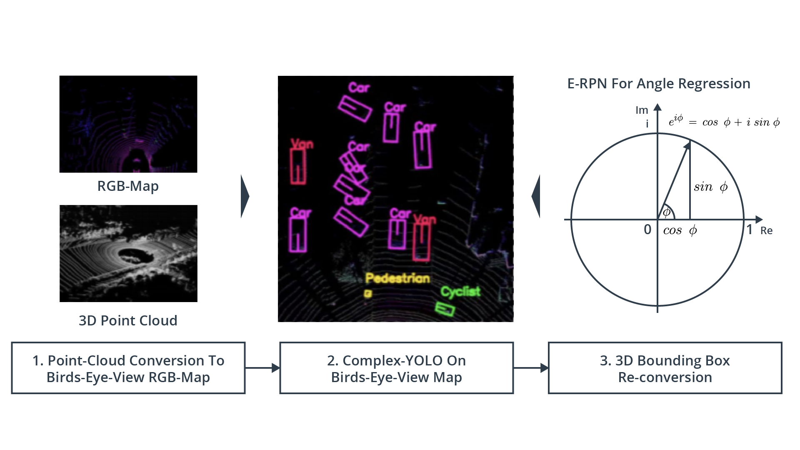
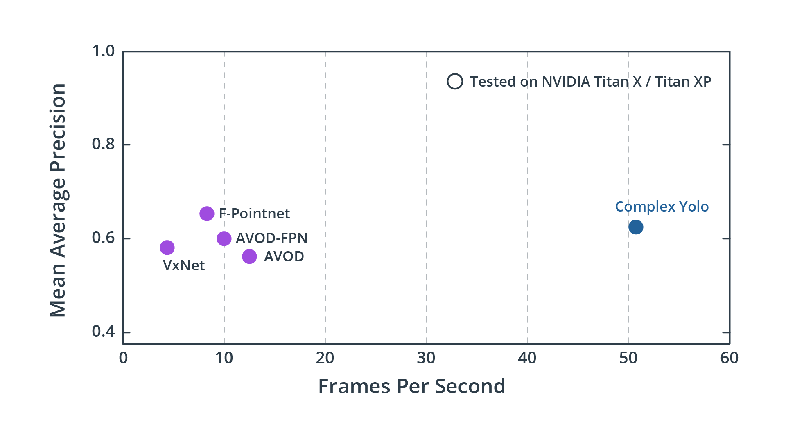
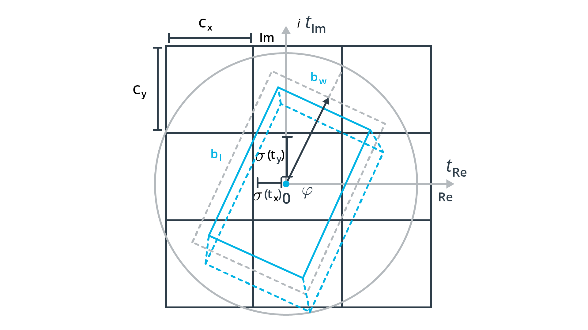
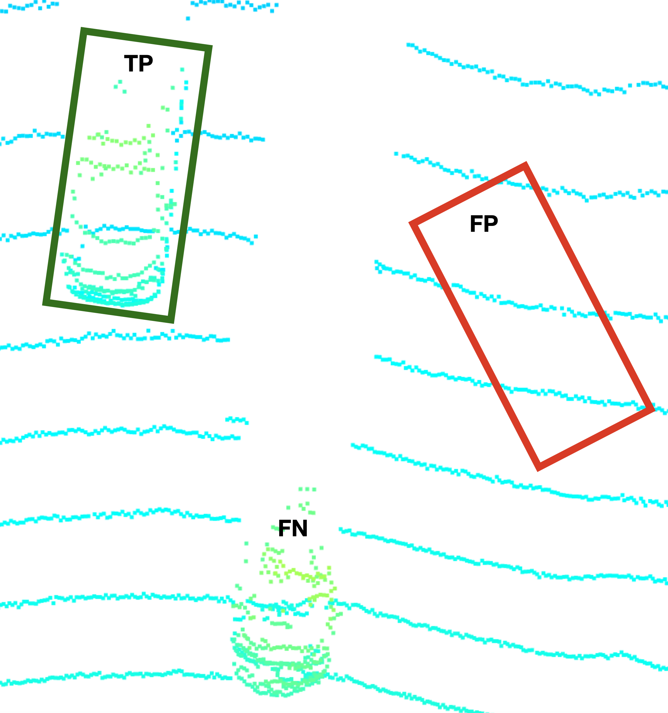
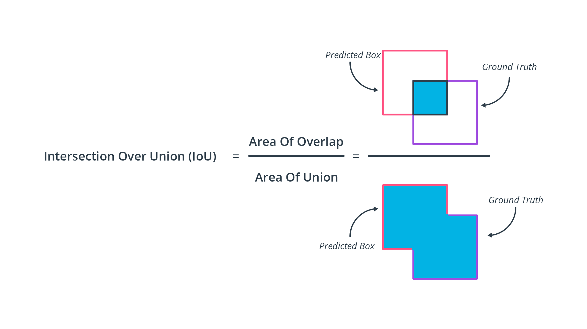
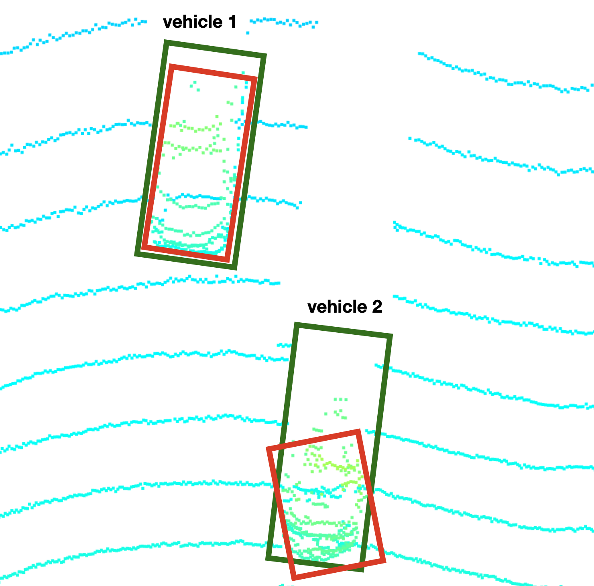

# Autonomous Perception: 3D Object Detection with Complex-YOLO

Camera-LiDAR sensor fusion detection takes four steps:
  1. [Computing LiDAR point-clouds from range images.](#computing-LiDAR-point-clouds-from-waymo-range-images)
  2. [Transforming the point-cloud to a Bird's Eye View using the Point Cloud Library (PCL).](#transforming-the-point-cloud-to-a-birds-eye-view-using-the-point-cloud-library)
  3. [Using both Complex-YOLO Darknet and Resnet to predict 3D dectections on transformed LiDAR images.](#model-based-object-detection-in-bev-image)
  4. [Evaluating the detections based Precision and Recall.](#performance-evaluation-for-object-detection)  

Complex-Yolo is both highly accurate and highly performant in production:

## Computing LiDAR Point-Clouds from Waymo Range Images

Waymo uses multiple sensors including LiDAR, cameras, radar for autonomous perception.  Even microphones are used to help detect ambulance and police sirens.

### Visualizing LiDAR Range and Intensity Channels

Roof-mounted "Top" LiDAR rotates 360 degrees with a vertical field of vision or ~20 degrees (-17.6 degrees to +2.4 degrees) with a 75m limit in the dataset. 

LiDAR data is stored as a range image in the Waymo Open Dataset. Using OpenCV and NumPy, we filtered the "range" and "intensity" channels from the image, and converted the float data to 8-bit unsigned integers.  Below is a visualization of two video frames, where the top half is the range channel, and the bottom half is the intensity for each visualization: 

### Visualizing th LiDAR Point-cloud

There are 64 LEDs in Waymo's top LiDAR sensor. Limitations of 360 LiDAR include the space between beams (aka resolution) widening with distance from the origin.  Also the car chasis will create blind spots, creating the need for Perimeter LiDAR sensors to be inlcuded on the sides of the vehicles.

  

We leveraged the Open3D library to make a 3D interactive visualization of the LiDAR point-cloud.  Commonly visible features are windshields, tires, and mirros within 40m. Beyond 40m, cars are like slightly rounded rectangles where you might be able to make ou the windshield.  Further away vehicles and extremely close vehicles typically have lower resolution, as well as vehicles obstructing the detection of other vehicles.

**10 Vehicles Showing Different Types of LiDAR Interaction:**

1. Truck with trailer - most of truck is high resolution visible, but part of the trailer is in the 360 LiDAR's blind-spot.
2. Car partial in blind spot, back-half isn't picked up well.  This car blocks the larges area behind it from being detected by the LiDAR.
3. Car shape is higly visible, where you can even see the side-mirrors and the LiDAR passing through the windshield.
4. Car driving in other lane.  You can see the resolution of the car being lower because the further away the 64 LEDs project the lasers, the futher apart the points of the cloud will be.  It is also obstructed from some lasers by Car 2.
5. This parked is unobstructed, but far enough away where it's difficult to make our the mirrors or the tires.
6. Comparing this car to Car 3, you can see where most of the definition is either there or slightly worse, because it is further way.
7. Car 7 is both far away and obstructed, so you can barely tell it's a car.  It's basically a box with probably a windshield.
8. Car 8 is similar to Car 6 on the right side, but obstructed by Car 6 on the left side. 
9. Car 9 is at the limit of the LiDAR's dataset's perception.  It's hard to tell it's a car.
10. Car 10 is at the limit of the LiDAR's perception, and is also obstructed by car 8.

## Transforming the point-cloud to a Bird's Eye View using the Point Cloud Library

### Convert sensor coordinates to Bird's-Eye View map coordinates 

The birds-eye view (BEV) of a LiDAR point-cloud is based on the transformation of the x and y coordinates of the points.

BEV map properties:
* Height:

  ![H_{i,j} = max(P_{i,j} \cdot [0,0,1]T)](https://render.githubusercontent.com/render/math?math=%5Ctextstyle+H_%7Bi%2Cj%7D+%3D+max%28P_%7Bi%2Cj%7D+%5Ccdot+%5B0%2C0%2C1%5DT%29)

* Intensity: 

  

* Density:

  

 is the set of points that falls into each cell, with  as the respective cell coordinates.  refers to the number of points in a cell.

### Compute intensity layer of the BEV map

We created a BEV map of the "intensity" channel from the point-cloud data. We identified the top-most (max height) point with the same (x,y)-coordinates from the point-cloud, and assign the intensity value to the corresponding BEV map point.  The data was normalized and outliers were removed until the features of interest were clearly visible. 

### Compute height layer of the BEV map 

This is a visualization of the "height" channel BEV map.  We sorted and pruned point-cloud data, normalizing the height in each BEV map pixel by the difference between max. and min.

## Model-based Object Detection in BEV Image

We used YOLO3 and Resnet deep-learning models to doe 3D Object Detection.  Complex-YOLO: Real-time 3D Object Detection on Point Clouds and Super Fast and Accurate 3D Object Detection based on 3D LiDAR Point Clouds.

### Extract 3D bounding boxes from model response 

The models take a three-channel BEV map as an input, and predict the class about coordinates of objects (vehicles).  We then transformed these BEV coordinates back to the vehicle coordinate-space to draw the bounding boxes in both images.

Below is a gif the of detections in action:

## Performance Evaluation for Object Detection

### Compute intersection-over-union between labels and detections 

Based on the labels within the Waymo Open Dataset, your task is to compute the geometrical overlap between the bounding boxes of labels and detected objects and determine the percentage of this overlap in relation to the area of the bounding boxes. A default method in the literature to arrive at this value is called intersection over union, which is what you will need to implement in this task.

After detections are made, we need a set of metrics to measure our progress. Common classification metrics for object detection include:

* *TP*: True Positive - Predicts vehicle or other object is there correctly
* *TN*: True Negative - Correctly predicts vehicle or object is not present
* *FP*: False Positive - Dectects object class incorrectly
* *FN*: False Negative - Didn't detect object class when there should be a dectection

One popular method of making these determinations is measuring the geometric overlap of bounding boxes vs the total area two predicted bounding boxes take up in an image, or th Intersecion over Union (IoU).

### Classification Metrics Based on Precision and Recall 

After all the LiDAR and Camera data has been transformed, and the detections have been predicted, we calculate the following metrics for the bounding box predictions:

#### Formulas

* *Precision*:

    

* *Recall*: 

    

* *Accuracy*: 
    
    

* *Mean Average Precision*: 
    
    

### Precision and Recall Results Visualizations

Results from 50 frames:

**Precision:** .954
**Recall:** .921

[Complex Yolo Paper](https://arxiv.org/pdf/1808.02350v1.pdf)